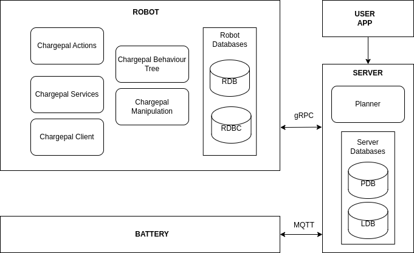

CHARGEPAL OVERALL ARCHITECTURE

Imagine a parking lot where we have a ChargePal server (server /local server), that manages a set of robots and battery carts. The system allows multiple robots and battery carts to communicate with the server, making them act as separate clients. 

First, we create a map of the ChargePal operational space. To avoid directly interacting with the cars, we use Adapter Stations (ADS) and mark their positions. After determining the number of robots and battery carts to be used, we mark the positions of the Robot Base Stations (RBS), Battery Waiting Stations (BWS), and Battery Charging Stations (BCS). Each robot and battery cart is assigned to their respective stations (RBS and BWS). The number of robots, battery carts, RBS, BWS, BCS, and ADS is manually set on the server as environment information. The map with all station positions is then provided to all the robots. 

As a summary the environment contains the following positions marked on the map.
| Station  | Description  |Naming Format|
| ------ | ------ |------ |
|    ADS : Adapter Station     | The station where the driver connects their car to and leaves. The robot interacts with the adapter station to charge the vehicle.|`ADS_"stationNumber"` and `ADS_ "stationNumber"_pick` (pickup position when cart is placed in the `ADS_"stationNumber"` position) |
|    BCS: Battery Charging Station     |    Station where the battery cart gets recharged.     |`BCS_"stationNumber"` and `BCS_"stationNumber"_pick`(pickup position when cart is placed in the `BCS_"stationNumber"` position) |
|BWS: Battery Waiting Station |Station where battery carts are placed if all BCSs are occupied.|`BWS_"stationNumber"` and `BWS _"stationNumber"_pick` (pickup position when cart is placed in the `BWS_"stationNumber"`position) |
|RBS: Robot Base Station |Station where robot gets recharged |`RBS_"stationNumber"` |

ChargePal system includes the following components: 

- Robot 
- Battery/Cart 
- Local Server 
- Android/iOS App

The image below shows a high-level architecture of the various ChargePal components

 
The internal components inside the robot and battery are described below. 

- **Chargepal Actions**  

This module defines the ROS actions that can be performed by the robot and encapsulates its server. These actions involve interactions with other components or executing specific robot related tasks.  

 

- **Chargepal Services**  

This module defines the ROS services that can be performed by the robot and encapsulates its server. These services could include API endpoints or utilities that support the core functionalities of the robot.  

 

- **Chargepal Client**  

This represents the gRPC client-side interface present in the robot that interacts with the server.  

 

- **Chargepal Behaviour Tree**  

This component implements a behavior tree, which is a model used to control the decision-making process within the robot. It helps in managing complex behaviors by breaking them down into simpler, reusable components.  

 

- **Chargepal Manipulation**  

This module handles the manipulation tasks within the robot. 

 

- **RDB (Robot Database)** 

This represents a sqlite3 database present inside the robot. It is a replica of the LDB (Local Database) on the server. The RDB is updated at 1Hz with the values from LDB. 

 

- **RDBC (Robot Database Copy)**  

This is another sqlite3 database present inside the robot, specifically tailored and dedicated to storing data relevant to the robot and its ongoing operations. 

 

- **Planner**  

The planner module is responsible for planning jobs for the robots. The planner is present inside the server. It interacts with the databases present inside the server to know the latest state of the environment. 

 

- **PDB (Planning Database)**  

This sqlite3 database supports the planner module by storing data related to planning tasks. It includes tables for schedules, resources, constraints, and other planning-related information.  

- **LDB (Local Database)**  
This sqlite3 database is present inside the server and holds information on the current state of all the robots and carts, the environment representation and orders. Information from every RDBC from a robot is pushed to LDB when robot performs an action. 

- **CDB (Chargepal Database)**  
This mysql database is present inside the server. This acts as the main database to which the battery and user app communicates to.

## chargepal_bundle
`chargepal_bundle` package is the root package that loads config parameters and starts all necessary nodes for the robot.  

## Dependencies
- nlohmann-json3-dev : `sudo apt-get -y install nlohmann-json3-dev`
- CPP-YAML: `sudo apt-get install libyaml-cpp-dev`
- ZmQ3: `sudo apt-get install libzmq3-dev`

| package | branch |Description|
| ------ | ------ |------ |
|[chargepal_actions](https://git.ni.dfki.de/chargepal/system-integration/robot-packages/chargepal_actions)    |   main     | Contains all the ROS action messages and its definitions. This package should be running inside the robot.|
|    [chargepal_behaviour_tree](https://git.ni.dfki.de/chargepal/system-integration/robot-packages/chargepal_behaviour_tree)    |    main    | Handles the job execution. This package should be running inside the robot.|
|    [chargepal_services](https://git.ni.dfki.de/chargepal/system-integration/robot-packages/chargepal_services)    |    main    |Contains all the ROS service messages and its definitions. This package should be running inside the robot.|
| [chargepal_client](https://git.ni.dfki.de/chargepal/system-integration/robot-packages/chargepal_client) | main| Handles the communication between the robot and the server. gRPC definitions are found here. This package should be running inside the robot.|
| [chargepal_map](https://git.ni.dfki.de/chargepal/manipulation/chargepal_map/-/tree/feat/start_state?ref_type=heads) | feat/start_state| Handles the plugin and plugout tasks. This package should be running inside the robot.|

- Ensure the `chargepal_local_server` is placed outside the `chargepal_ws`

## Installation
- Create a `catkin_ws` folder and a `src` folder inside it.
- Clone the following packages: `chargepal_bundle`,`chargepal_behaviour_tree`,`chargepal_client`,`chargepal_actions`,`chargepal_services`inside a `catkin_ws/src`.
- Add submodules by running `git submodule init` and `git submodule update`. 
- Inside `catkin_ws/src` run `ln -s chargepal_behaviour_tree/BehaviorTree.CPP`. This creates a softlink to the BehaviorTree.CPP, that is present inside the `chargepal_behaviour_tree` package, to outside the package.
- Install Python dependencies with `pip install -r requirements.txt`.
- Run `catkin_make` inside `/catkin_ws`.
 
## Checklist before starting the nodes
- [ ] Make sure the local database is created. Set up the envionment representation in the local database (server). 
- [ ] Make sure missions are added inside MiR platform.
- [ ] Make sure `config.yaml` (chargepal_bundle) is set with the required values. 
- [ ] `./create_ldb.py` whenever the enviroinment is reset to the base position ( robot and carts in their respective bases).
- [ ] Check if the `.py` and `.pyi` files are created inside `/chargepal_client/src/chargepal_client`. If not, inside `/chargepal_client/src/chargepal_client` run `python -m grpc_tools.protoc -I. --python_out=. --pyi_out=. --grpc_python_out=. communication.proto ` to create them.

## Execution

**Step 1:** Set the [configuration file](./cfg/config.yaml)

| Parameter | Example |Notes |
| ------ | ------ |------ |
|  server_address      |   "localhost:50059"     |Make sure to set the ip/hostname and port number of [chargepal_local_server](https://git.ni.dfki.de/chargepal/system-integration/server-packages/chargepal_local_server)|
|     mir_address   | "192.168.12.20"       | MiR adress can be found in the [wiki](https://git.ni.dfki.de/chargepal/chargepal_wiki/-/wikis/Documentation/onboard-devices-and-network)|
|     robot_name   | 'ChargePal1'       |The name of the robot. Make sure to follow the same naming convention|
|     robot_id   | 'ER-FLEX-00040'     |The robot id mentioned on each robot|
|     sim_flag   | True      |Set this value to `True` to simulate robot actions as sleep intervals.Else, set it to `False` if you want to see the robot perform the action|
|     recovery_enabled   | False       |Set this to `True` to have recovery actions enabled for any failed action. Else, set it to `False` to pause and ask for manual recovery|
|     server_timeout   | 600       | Value in seconds which denote the time interval after which a technician is to be called when connection to server has failed|

**Step 2:** `catkin_make` and `source devel/setup.bash` the workspace.

**Step 3:** Run `roslaunch chargepal_bundle startup.launch` or `roslaunch chargepal_bundle startup_sim.launch` for simulation without `chargepal_map`. Wait for a few seconds for it to finish starting all the launch files. Then run `rosrun chargepal_behaviour_tree behaviour_tree`. If you are running the simulation, run `./create_ldb_orders.py` in `chargepal_local_server/src/chargepal_local_server` to start the execution (`create_ldb_orders.py` adds a job entry, which then triggers the execution).
